# Comparify

Welcome to Comparify! This web-app is designed to help users find the best deals and make informed purchasing decisions by aggregating, organizing, and analyzing product data from various e-commerce websites. Below are the key features of our platform:

## Key Features

### Data Aggregation

Extracts comprehensive and accurate product data from multiple e-commerce websites (Flipkart, AliExpress, SmartPrix), including prices, features, and user reviews. Stores favourite products systematically for easy retrieval and analysis.

### Search Functionality

Allows users to search for products using various filters, providing quick and accurate search results. Image search functionality is also implemented using the Vision API, allowing users to find deals by snapping product photos.

### Comparison Tool

Enables users to compare different products based on various scraped parameters, presenting clear and intuitive comparison data to identify the best deals.

### Analysis and Insights

Analyzes data using AI to generate actionable insights, helping users make informed purchasing decisions.

### Multilinguality

Supports multiple languages to cater to a diverse user base, providing an inclusive experience for users worldwide.

### User-Friendly Interface

Features a clean and intuitive interface to ensure a seamless user experience, simplifying the process of searching, comparing, and analyzing products.

### Customer Support

Provides robust customer support in the form of a 24/7 available chatbot to assist users effectively with any issues or queries they may have.

## App

  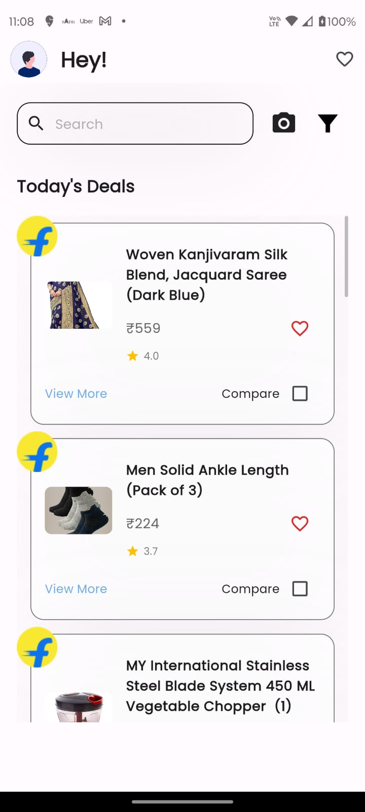
  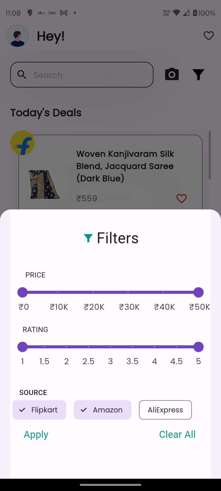
  
  
  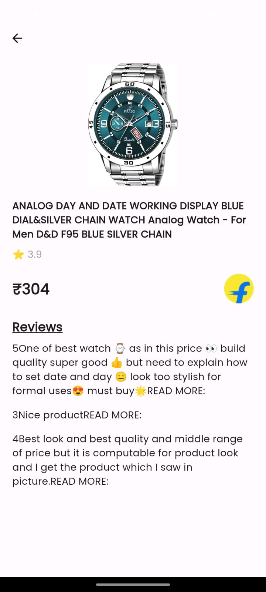
  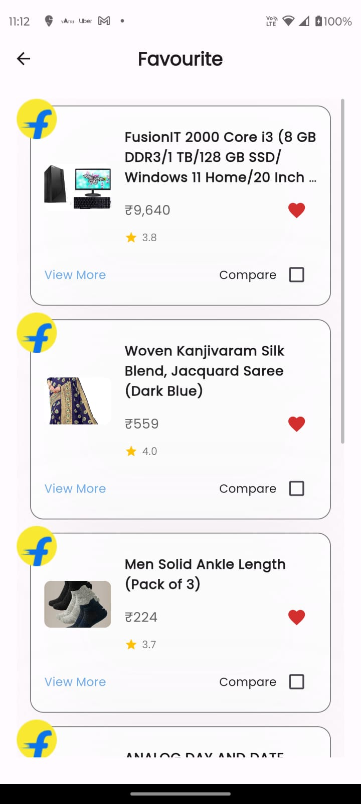

## Website

  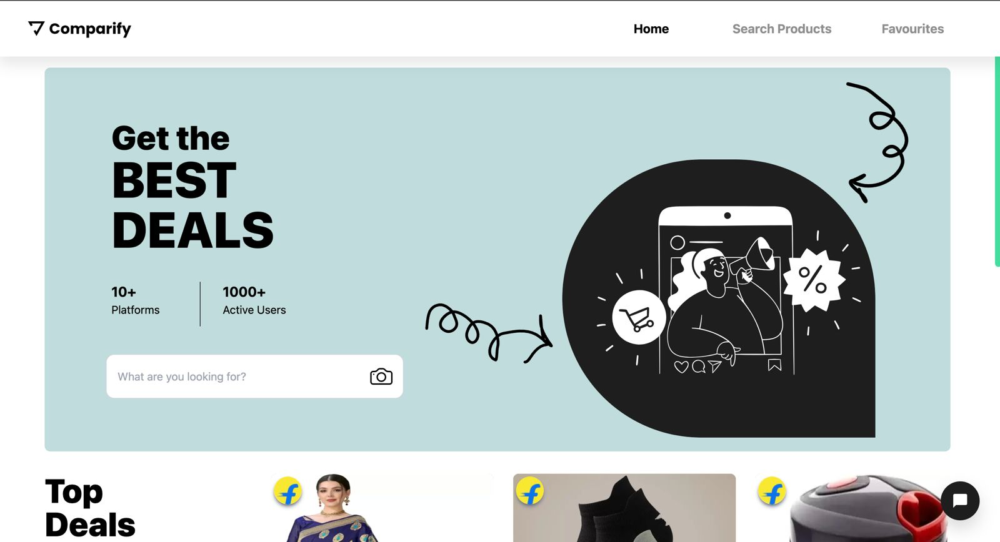
  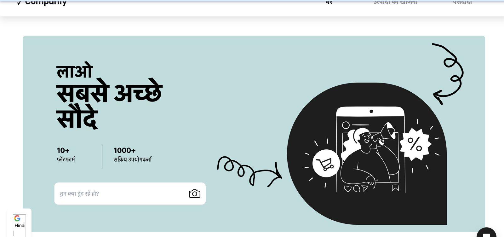
  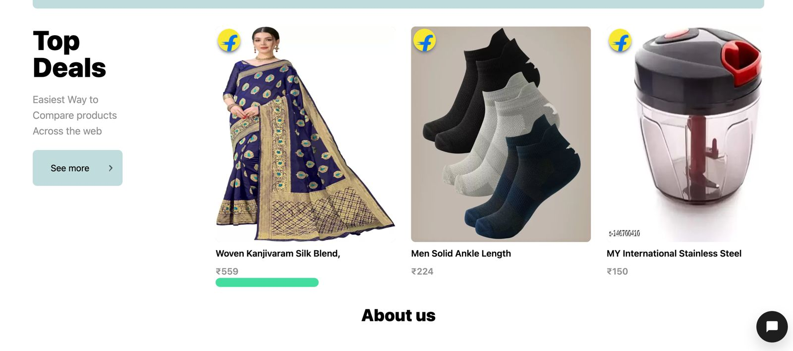
  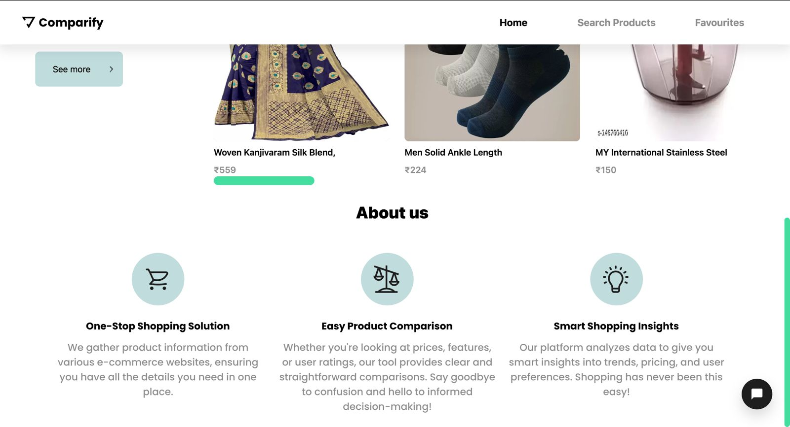
  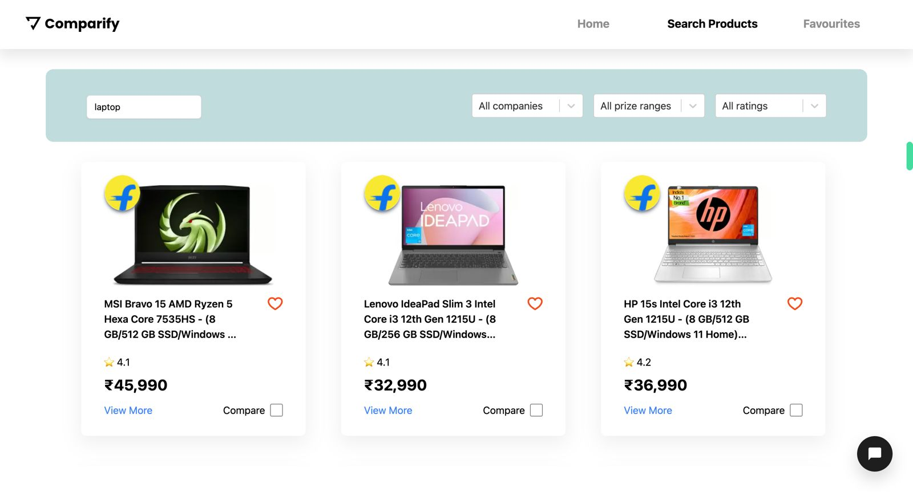
  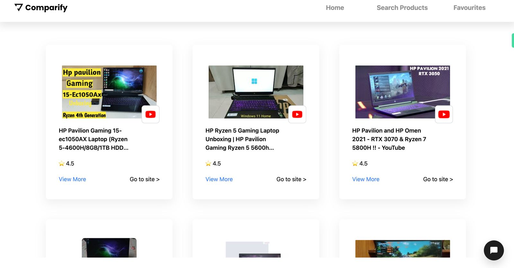
  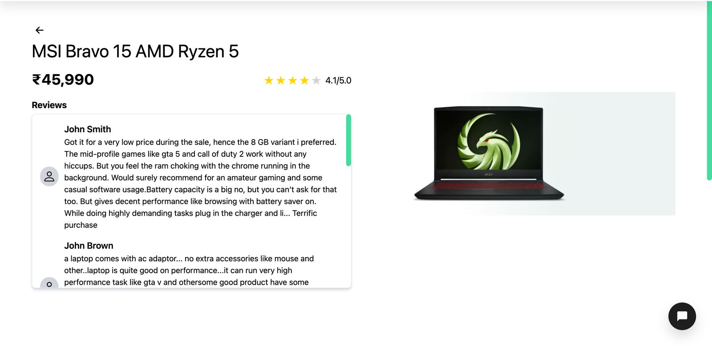
  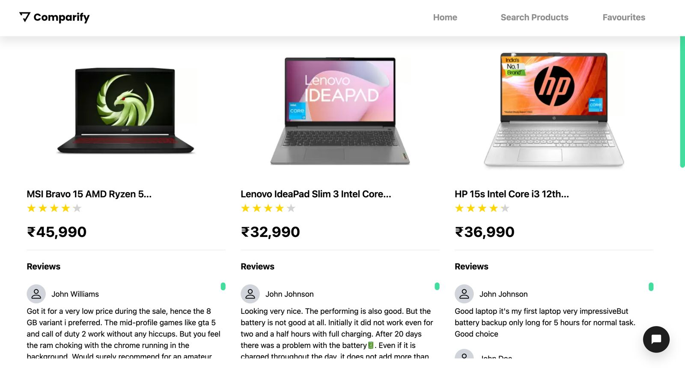
  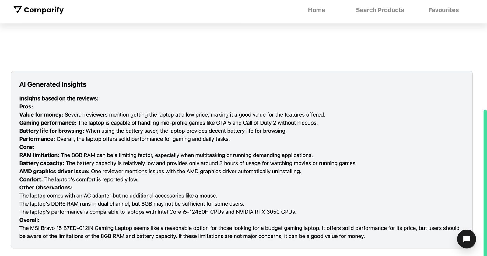
  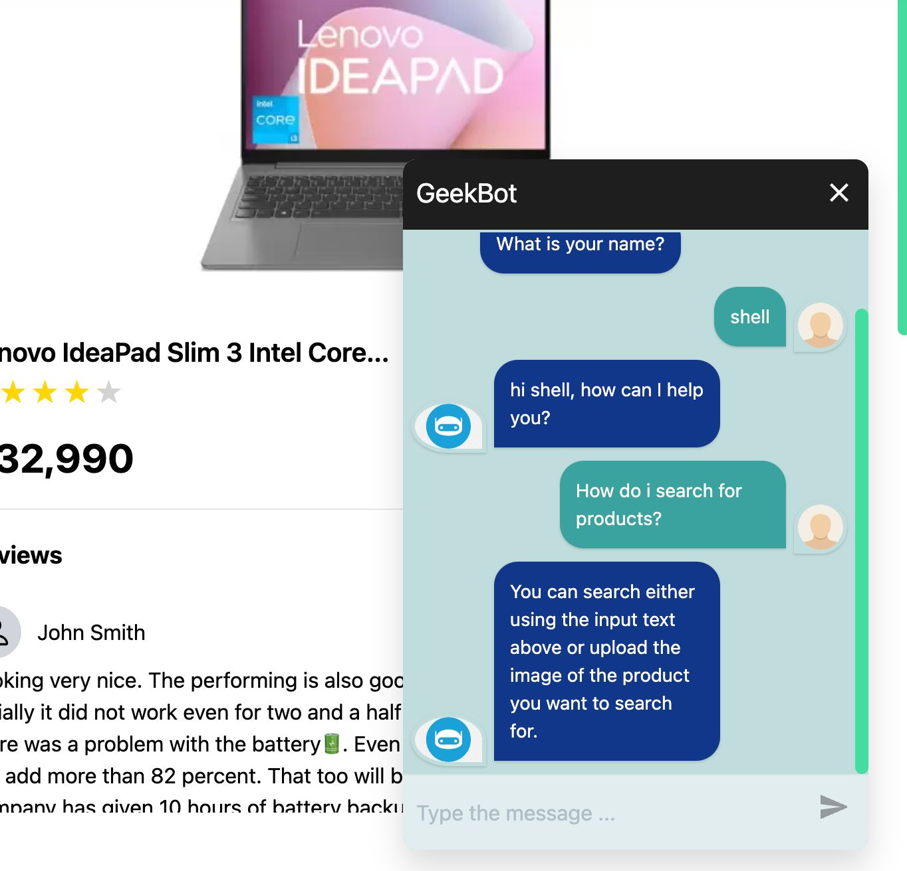

